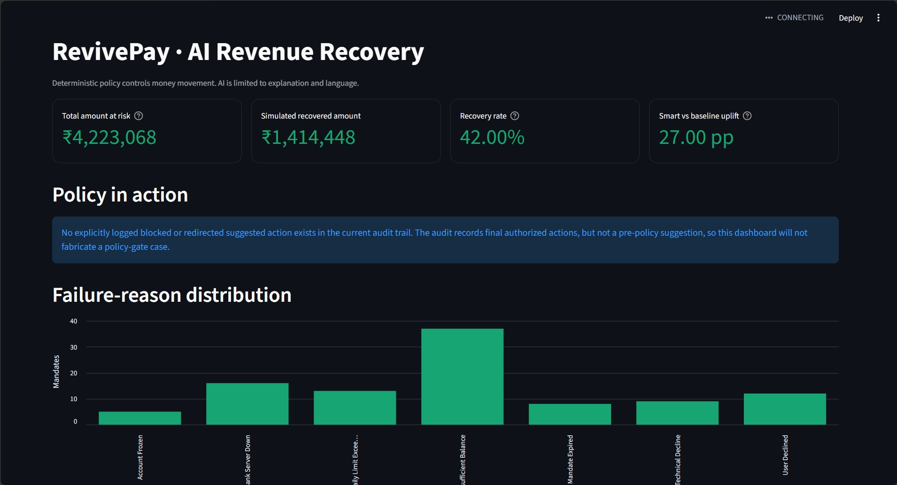
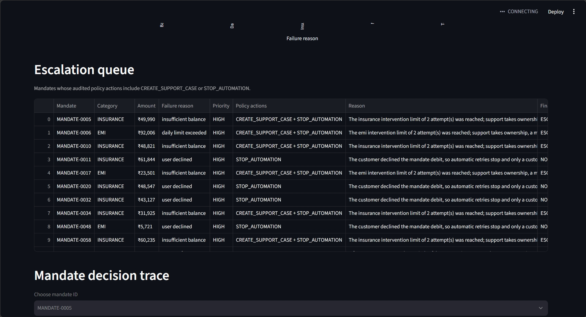
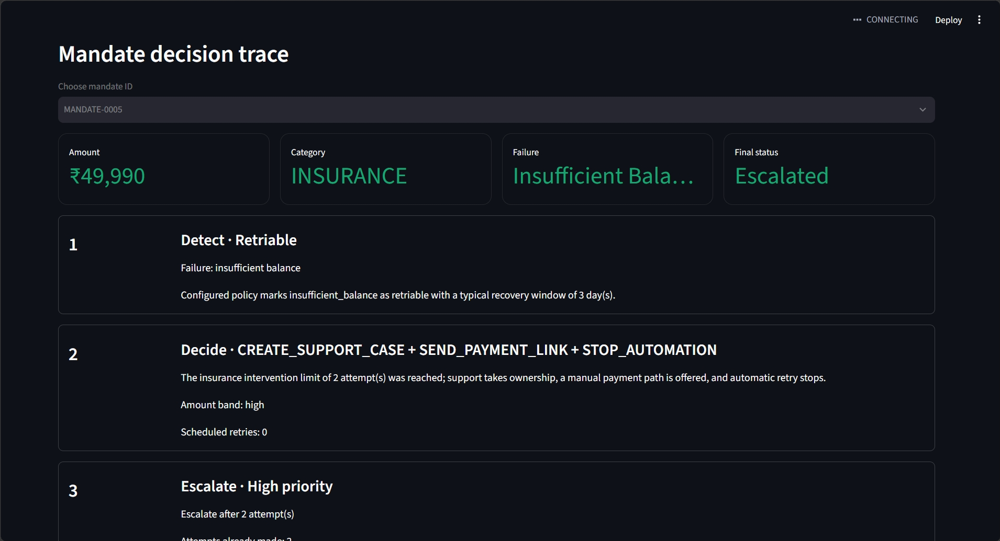
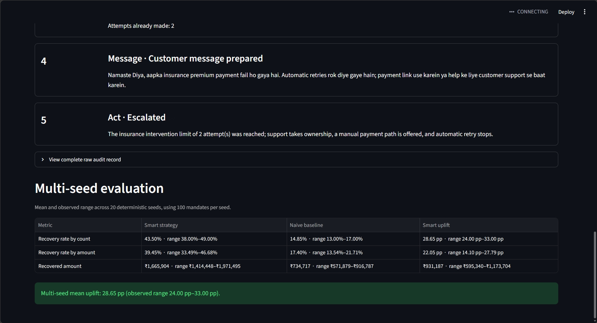

# RevivePay — AI Revenue Recovery

An educational Python backend project that models recovery of failed recurring UPI AutoPay payments. It decides whether a failure may be retried, creates legal retry schedules, applies category-aware escalation, generates customer messages, simulates recovery, and compares the result with a naive fixed-interval strategy.

The central engineering principle is:

> Deterministic rules for hard business constraints; AI only for judgment and natural-language tasks.

This is a simulation and portfolio project. It does not connect to NPCI, banks, payment service providers, or real customer accounts.

## Demo dashboard

The single-page Streamlit dashboard turns the pipeline's existing JSON outputs
into a pitch-ready operational view. It shows money at risk, simulated recovery,
smart-vs-baseline uplift, the failure mix, the human escalation queue, a complete
mandate decision trace, and the statistically honest 20-seed evaluation. The
figures below are deterministic demo results, not production recovery claims.

Run it from the repository root:

```powershell
streamlit run src/dashboard.py
```

### Portfolio overview



### Escalation queue



### Auditable mandate decision trace





<details>
<summary>Compact dashboard capture</summary>


</details>

## Problem

Recurring payments fail for different reasons. A bank outage may recover within hours, insufficient balance may require several days, and an expired mandate should never be retried automatically. Payment type matters too: an EMI or insurance payment deserves earlier human attention than a low-cost subscription.

A useful recovery system must answer:

1. Is automatic retry allowed?
2. When can each retry legally run?
3. When should automation stop and involve support?
4. What should the customer be told?
5. Did the simulated retry recover the payment?
6. Does the strategy outperform a naive baseline on the same failures?

## Architecture

```text
Razorpay Test Mode
        │ signed webhook
        ▼
 webhook_server.py ──► normalize_event() ──► detect.py
                                              │
                                              ▼
                                decide.py + intervention_router.py
                                              │
                                              ▼
                                escalate.py ─► message.py
                                              │
                                              ▼
                                  simulated act.py adapter
                                              │
                                              ▼
                                      audit_trail.json

Synthetic batch:

failed_mandates.json
        │
        ▼
   detect.py       deterministic retriability + optional AI diagnosis
        │
        ▼
   decide.py       deterministic intervention gate + schedule
        │                    │
        │                    └──► intervention_router.py
        │
        ▼
  escalate.py      category-aware human escalation threshold
        │
        ▼
   message.py      constrained Hinglish generation + safe fallback
        │
        ▼
     act.py        seeded execution simulation and audit trail
        │
        ├────────► final_report.json
        └────────► audit_trail.json

failed_mandates.json ──► baseline.py ──► baseline_report.json
                                  │
final_report.json ────────────────┴──► comparison_summary.json

audit_trail.json ──► find_failure_case.py ──► failure_case_example.md

final_report.json + comparison_summary.json + audit_trail.json
        + multi_seed_report.json ──► dashboard.py
```

External Razorpay `payment.failed` events enter through `src/ingest.py`.
Pydantic validates the consumed webhook subset and the normalized mandate at
this trust boundary. Malformed events are logged and rejected; successful
normalization returns an ordinary dictionary, so Pydantic does not leak into
the deterministic pipeline stages.

The Flask endpoint is `POST /webhooks/razorpay`. It verifies the HMAC-SHA256
signature over the untouched request body, deduplicates the
`x-razorpay-event-id` in `data/webhook_events.sqlite3`, and acknowledges
duplicates or unsupported event types with HTTP 200. Configure:

```env
RAZORPAY_WEBHOOK_SECRET=your_test_mode_webhook_secret
```

Start the local server with:

```powershell
python src/webhook_server.py
```

The endpoint handles `payment.failed`, `subscription.pending`,
`subscription.halted`, and `subscription.charged`. Pending is the primary
subscription charge-failure signal and enters the same recovery pipeline as a
payment failure. Failed, pending, and halted records use the existing in-process
stage functions. A charged subscription is already a successful signal, so it
is written as an externally confirmed recovery rather than being falsely sent
through failure detection. Automatic UPI retries remain a **simulated execution
adapter**; this repository does not claim to invoke a live or Test Mode retry API.

The baseline deliberately starts from the original raw dataset, not smart-pipeline output. This keeps the population, amounts, failure mix, seed, retry cap, and probability assumptions constant so the experiment measures strategy rather than input differences.

See [docs/ARCHITECTURE.md](docs/ARCHITECTURE.md) for stage contracts and trust boundaries.

## Core scheduling algorithm

`decide.py` first calls the deterministic intervention router. The router uses
failure reason, category, amount band, and attempts already made to select only
centrally permitted actions. A retry schedule can exist only when the selected
actions contain `RETRY_AUTOPAY`.

`build_retry_schedule(record)` then separates recovery strategy from execution-window enforcement:

1. Recheck centralized failure policy and fail closed for unknown or non-retriable reasons.
2. Calculate remaining attempts from `MAX_RETRIES - attempts_already_made`.
3. Select deterministic not-before offsets for the failure reason.
4. Move each candidate forward to the earliest permitted execution window.
5. Preserve strict chronological ordering if two candidates reach the same boundary.
6. Validate the complete schedule independently before returning it.

Examples of action policy are explicit: insufficient balance produces a balance
reminder plus delayed retry; a bank outage produces a quiet retry; an expired
mandate produces renewal only; and capped/high-value failures stop automation
or enter support. These actions and their reasons are preserved in the audit.

All input timestamps are explicitly interpreted or converted to `Asia/Kolkata`.
Schedules retain readable date/time fields and also include an authoritative
ISO-8601 `scheduled_at` value with the `+05:30` offset, so behavior never depends
on the machine's local timezone.

Strategies differ intentionally:

- `insufficient_balance`: retries are spaced across days to allow replenishment.
- `bank_server_down`: retries begin within hours because the failure is likely transient.
- `technical_decline`: rapid initial retry followed by more recovery time.
- `daily_limit_exceeded`: the first retry is always on a later calendar day.

`validate_schedule()` asserts retry caps, attempt ordering, timestamp ordering, recognized window labels, and window boundaries. Gemini cannot create or modify a schedule.

## AI and deterministic responsibilities

| Responsibility | Implementation | Why |
|---|---|---|
| Failure retriability | Deterministic | Hard policy must be stable, auditable, and fail closed. |
| Intervention routing | Deterministic decision table | Only an allow-listed action can authorize money movement or customer contact. |
| Retry cap | Deterministic | A model must never reinterpret an attempt limit. |
| Execution windows | Deterministic | Legal/operational time validation is binary. |
| Category escalation | Deterministic | Human-review thresholds must be consistent. |
| Recovery simulation | Deterministic seeded probability | Experiments must be reproducible. |
| Short failure diagnosis | Optional Gemini | Natural-language judgment can improve explanation. |
| Schedule justification | Optional Gemini | AI explains an existing schedule but cannot alter it. |
| Customer Hinglish | Optional Gemini | Natural phrasing is a language-generation task. |

All AI stages are fallback-first. Missing SDKs, absent keys, API failures, malformed JSON, incomplete batches, or unsafe messages do not stop the pipeline. Unknown failure reasons are never sent for automatic retry.

## Setup

Requirements:

- Python 3.11+
- A Gemini API key only if AI-enhanced text is desired

Create and activate a virtual environment:

```powershell
python -m venv .venv
.venv\Scripts\Activate.ps1
python -m pip install -r requirements.txt
```

For macOS or Linux, activation is:

```bash
source .venv/bin/activate
```

Optional Gemini configuration:

```powershell
Copy-Item .env.example .env
```

Then edit `.env`:

```env
GEMINI_API_KEY=your_actual_api_key
```

Never commit `.env`. It is excluded by `.gitignore`. Without a key, the entire pipeline still runs using deterministic diagnosis, justification, and message templates.

## Running the project

Run every stage in fail-fast order:

```powershell
python src/run_all.py
```

Launch the read-only pitch dashboard after the pipeline and multi-seed report
have been generated:

```powershell
streamlit run src/dashboard.py
```

The dashboard reads `data/final_report.json`,
`docs/comparison_summary.json`, `logs/audit_trail.json`, and
`data/multi_seed_report.json` directly. It does not rerun or modify the pipeline.

Run stages individually from the repository root:

```powershell
python src/generate_data.py
python src/detect.py
python src/decide.py
python src/escalate.py
python src/message.py
python src/act.py
python src/baseline.py
python src/find_failure_case.py
```

Each stage reads the previous stage's JSON and writes a new artifact. If a stage fails, `run_all.py` prints its name, stops immediately, and returns a non-zero exit status.

## Testing

Run the complete suite:

```powershell
python -m pytest -q
```

Run the statistically aggregated 20-seed comparison:

```powershell
python src/multi_seed_eval.py
```

This writes `data/multi_seed_report.json` and prints per-seed results plus mean,
sample standard deviation, minimum, maximum, and uplift range. It reuses the
same smart and baseline simulators rather than implementing a second outcome model.

The tests cover reproducible data generation, schema validity, fail-closed detection, fallback behavior, retry caps, permitted windows, reason-specific spacing, category escalation, messaging safety, deterministic simulation, baseline rejection, real-case extraction, and fail-fast orchestration.

Current verified result:

```text
70 passed
```

Current full-suite line coverage is 73%. The ingestion boundary, webhook
adapter, intervention router, and dashboard are covered at 81–92%; the
remaining gaps are primarily optional Gemini/network branches and CLI-only
error paths.

## Reproducible results

The statistically honest comparison uses 20 deterministic seeds over the same
100-mandate portfolio. Values below are the mean and observed min–max range,
not a selectively chosen single run:

| Metric | Smart strategy | Naive baseline | Smart uplift |
|---|---:|---:|---:|
| Recovery rate by count | 43.50% (38.00–49.00%) | 14.85% (13.00–17.00%) | 28.65 pp (24.00–33.00 pp) |
| Recovery rate by amount | 39.45% (33.49–46.68%) | 17.40% (13.54–21.71%) | 22.05 pp (14.10–27.79 pp) |
| Recovered amount | ₹1,665,904 mean (₹1,414,448–₹1,971,495) | ₹734,717 mean (₹571,879–₹916,787) | ₹931,187 mean (₹595,340–₹1,173,704) |

The single-seed JSON reports remain useful for replaying one exact audit trail,
but pitch-level performance claims use the multi-seed distribution. These are
still synthetic results based on illustrative probabilities, not claims about
real-world recovery performance.

## Baseline design

The deliberately naive strategy:

- retries every failure, including non-retriable types;
- uses a fixed eight-hour interval;
- ignores failure-reason recovery behavior;
- ignores category escalation;
- does not move attempts into legal windows;
- records out-of-window attempts as rejected.

Valid baseline attempts use the same failure-specific probability assumptions and deterministic per-attempt draws as the smart simulation wherever logically possible.

## Failure handling and auditability

- Unknown failure reasons fail closed and require human review.
- Unsupported categories stop processing instead of receiving a guessed risk policy.
- Invalid schedules fail validation before execution.
- Non-retriable mandates execute zero retries.
- Recovery stops subsequent attempts immediately.
- Category thresholds stop another blind retry and mark the mandate escalated.
- Exhausted schedules are distinguished from escalated and non-retriable cases.
- Every executed attempt records its schedule, window, probability, deterministic draw, outcome, and stopping reason.
- `find_failure_case.py` documents an actual audit escalation or explicitly states that the seed produced none.

## Project structure

```text
upi-recovery-agent/
├── src/
│   ├── __init__.py
│   ├── constants.py
│   ├── time_utils.py
│   ├── ingest.py
│   ├── webhook_server.py
│   ├── intervention_router.py
│   ├── generate_data.py
│   ├── detect.py
│   ├── decide.py
│   ├── escalate.py
│   ├── message.py
│   ├── act.py
│   ├── baseline.py
│   ├── multi_seed_eval.py
│   ├── dashboard.py
│   ├── find_failure_case.py
│   └── run_all.py
├── data/                     # stage outputs, single-seed and multi-seed reports
│   └── webhook_events.sqlite3 # created when the webhook server receives events
├── logs/
│   └── audit_trail.json
├── docs/
│   ├── ARCHITECTURE.md
│   ├── comparison_summary.json
│   └── failure_case_example.md
├── tests/
├── .env.example
├── .gitignore
├── requirements.txt
└── README.md
```

Root-level `run_all.py` and `find_failure_case.py` are retained as convenience/compatibility entry points; the documented canonical implementations are under `src/`.

## Limitations

- All mandates and customer names are synthetic.
- Recovery probabilities are illustrative constants, not trained estimates.
- No real UPI, bank, mandate, notification, or support APIs are called.
- JSON files are suitable for a learning pipeline, not concurrent production workloads.
- Execution windows are simplified daily windows and do not model holidays or provider-specific rules.
- The simulation does not model fees, settlement, idempotency keys, network timeouts, or reconciliation.
- AI safety checks are intentionally lightweight and would require stronger policy evaluation in production.

## Future Improvements

- Introduce provider-specific calendars and configurable regional time zones.
- Build a calibrated recovery-scoring model from privacy-safe historical
  outcomes. It would rank interventions inside deterministic policy bounds;
  it would never replace retriability, caps, execution windows, or stop rules.
- Replace the demo SQLite webhook dedupe set with end-to-end idempotent command
  handling, durable processing leases, and a dead-letter queue with replay and
  operator tooling.
- Add chaos and fault-injection tests for duplicate/out-of-order webhooks,
  provider timeouts, process crashes between dedupe and audit writes, corrupted
  payloads, partial storage failures, and retry storms.
- Add payment-provider adapters behind interfaces.
- Store events in an append-only database with correlation IDs and immutable audit metadata.
- Add queue-based execution, retries for infrastructure failures, and observability metrics.
- Add confidence intervals and significance tests on top of the current
  multi-seed min/max and standard-deviation report.
- Add approval workflows and support-ticket integrations for escalated payments.
- Strengthen message evaluation with locale, accessibility, and compliance review.
